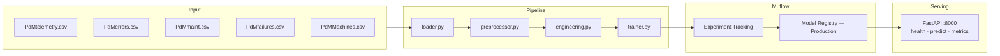

# Predictive Maintenance ML System


End-to-end ML Engineering challenge using the Microsoft Azure PdM dataset.  
Goal: predict whether a machine will fail in the next 24 hours using telemetry,
error logs, maintenance history and machine metadata.

---

## Quick Start (5 minutes)

```bash
# 1. Clone and setup
git clone https://github.com/harrysonguerrero-max/pdm-ml.git
cd pdm-ml
cp .env.example .env
pip install -e ".[dev]"

# 2. Download dataset (pick one method)
```

**Option A — Kaggle CLI (recommended)**

```bash
pip install kaggle
kaggle datasets download arnabbiswas1/microsoft-azure-predictive-maintenance
unzip microsoft-azure-predictive-maintenance.zip -d data/raw
```

**Option B — Manual**  
Download from https://www.kaggle.com/datasets/arnabbiswas1/microsoft-azure-predictive-maintenance  
Extract the 5 CSVs into `data/raw/`.

Expected files after download:
```
data/raw/PdMtelemetry.csv
data/raw/PdMerrors.csv
data/raw/PdMmaint.csv
data/raw/PdMfailures.csv
data/raw/PdMMachines.csv
```

```bash
# 3. Full Docker demo (recommended for reviewers)
make up                    # builds images, starts MLflow + API
make logs                  # follow live output — see training in real time
```

| Service      | URL                          |
|---|---|
| MLflow UI    | http://localhost:5000         |
| REST API     | http://localhost:8000         |
| API Docs     | http://localhost:8000/docs    |
| Metrics      | http://localhost:8000/metrics |

> After `make up` completes, the training pipeline runs automatically and the model
> is registered in MLflow under the **Production** stage.

---

## Environment Variables

Copy `.env.example` to `.env` before running anything.

```bash
cp .env.example .env
```

```dotenv
# MLflow
MLFLOW_TRACKING_URI=http://localhost:5000   # use http://mlflow:5000 inside Docker
MLFLOW_EXPERIMENT_NAME=pdm-predictive-maintenance
MLFLOW_MODEL_NAME=pdm-failure-predictor

# Data
RAW_DATA_PATH=data/raw
PROCESSED_DATA_PATH=data/processed

# Model
PREDICTION_WINDOW_HOURS=24
FAILURE_THRESHOLD=0.35
PROMOTION_MIN_PR_AUC=0.80     # auto-promote only if PR-AUC >= 0.80 (40× above baseline)
```

> **Docker users**: `MLFLOW_TRACKING_URI` is automatically overridden to
> `http://mlflow:5000` by `docker-compose.yml` — no manual change needed.

---

## Architecture



---

## Available Commands

| Command          | Description                                             |
|---|---|
| `make install`   | Install all dependencies                                |
| `make train`     | Run training pipeline (MLflow must be running)          |
| `make train-local` | Start MLflow in background + run pipeline             |
| `make serve`     | Start API locally with hot-reload                       |
| `make up`        | Build images, start MLflow + API with Docker Compose    |
| `make down`      | Stop all containers (data persists)                     |
| `make demo-down` | Stop containers + delete volumes (clean slate)          |
| `make logs`      | Follow live logs from all containers                    |
| `make logs-train`| Follow training job logs only                           |
| `make test`      | Run full test suite                                     |
| `make test-cov`  | Run tests with coverage report                          |
| `make lint`      | Check code style with ruff                              |
| `make check`     | `lint` + `test` in one command (run before committing)  |
| `make rollback`  | Demote current Production model → promote previous      |
| `make registry-list` | List all registered model versions and stages       |

---

## API Usage

### Health check

```bash
curl http://localhost:8000/health
```
```json
{
  "status": "healthy",
  "model_loaded": true,
  "model_version": "1",
  "model_name": "pdm-failure-predictor"
}
```

### Prediction

```bash
curl -X POST http://localhost:8000/predict \
  -H "Content-Type: application/json" \
  -d '{
    "machine_id": 1,
    "volt": 170.0, "rotate": 450.0, "pressure": 95.0, "vibration": 40.0,
    "volt_mean_3h": 170.5, "volt_std_3h": 1.2,
    "rotate_mean_3h": 450.1, "rotate_std_3h": 0.8,
    "pressure_mean_3h": 95.1, "pressure_std_3h": 0.5,
    "vibration_mean_3h": 40.1, "vibration_std_3h": 0.3,
    "volt_mean_24h": 170.2, "volt_std_24h": 2.1,
    "rotate_mean_24h": 449.9, "rotate_std_24h": 1.9,
    "pressure_mean_24h": 95.2, "pressure_std_24h": 1.1,
    "vibration_mean_24h": 40.0, "vibration_std_24h": 0.9,
    "volt_lag1": 170.1, "volt_lag2": 169.8, "volt_lag3": 170.3,
    "rotate_lag1": 450.2, "rotate_lag2": 449.8, "rotate_lag3": 450.0,
    "pressure_lag1": 94.8, "pressure_lag2": 95.2, "pressure_lag3": 95.0,
    "vibration_lag1": 40.2, "vibration_lag2": 39.8, "vibration_lag3": 40.1,
    "volt_delta": 0.5, "rotate_delta": -0.3,
    "pressure_delta": 0.2, "vibration_delta": -0.1,
    "error1_count": 0, "error2_count": 1, "error3_count": 0,
    "error4_count": 0, "error5_count": 0,
    "hours_since_comp1": 120, "hours_since_comp2": 240,
    "hours_since_comp3": 60, "hours_since_comp4": 180,
    "model_id": 2, "age": 7
  }'
```
```json
{
  "machine_id": 1,
  "failure_probability": 0.73,
  "prediction": 1,
  "prediction_label": "FAILURE EXPECTED",
  "prediction_window_hours": 24,
  "model_version": "1",
  "threshold_used": 0.35
}
```

### Prometheus Metrics

```bash
curl http://localhost:8000/metrics
# Returns Prometheus text format:
# http_requests_total{handler="/predict", method="POST", status_code="200"} 42.0
# http_request_duration_seconds_bucket{...}
```

### Model Rollback

```bash
make rollback        # demotes current Production → Archived, promotes last Archived
make registry-list   # inspect all registered versions and their stages
```

> Interactive docs with full schema and built-in request tester: http://localhost:8000/docs

---

## Project Structure

```
pdm-ml/
├── src/
│   ├── config.py              # Centralized config — Pydantic Settings
│   ├── data/
│   │   ├── loader.py          # Loads & validates 5 CSVs with Polars
│   │   └── preprocessor.py    # Joins, error counts, component ages, target
│   ├── features/
│   │   └── engineering.py     # Rolling stats, lags, deltas — 32 features
│   ├── models/
│   │   ├── trainer.py         # XGBoost + MLflow tracking + Registry promotion
│   │   └── evaluator.py       # PR-AUC, F2-Score, confusion matrix
│   └── serving/
│       ├── app.py             # FastAPI — /health · /predict · /metrics
│       └── schemas.py         # Pydantic I/O validation schemas
├── pipelines/
│   └── train_pipeline.py      # End-to-end pipeline entry point
├── scripts/
│   ├── rollback.py            # Demote Production → promote previous Archived
│   └── registry_list.py       # List all registered versions and stages
├── tests/
│   ├── conftest.py            # Shared in-memory fixtures (no CSV needed)
│   ├── test_loader.py
│   ├── test_features.py
│   ├── test_preprocessor.py
│   └── test_api.py
├── docker/
│   ├── Dockerfile
│   ├── docker-compose.yml
│   └── prometheus.yml         # Prometheus scraping config for /metrics
├── .github/workflows/ci.yml   # Lint + test on every push
├── .env.example
├── pyproject.toml
└── Makefile
```

---

## Key Design Decisions

| Decision              | Choice                      | Rationale |
|---|---|---|
| Problem framing       | Binary classification        | Operationally actionable; multiclass adds complexity without proportional value |
| Train/test split      | Temporal split, not random   | Simulates real production — model always predicts the future |
| Primary metric        | PR-AUC + F2-Score            | Accuracy is misleading at 1–3% positive rate; F2 penalises FN more than FP |
| Decision threshold    | 0.35 (not 0.5)               | FN (missed failure) costs 5–10× more than FP (unnecessary inspection) |
| Promotion threshold   | PR-AUC ≥ 0.80                | Only models 40× above baseline (~0.020) reach Production automatically |
| Imbalance handling    | `scale_pos_weight` in XGBoost | Avoids SMOTE leakage risk; no synthetic samples cross the train/test boundary |
| Experiment tracking   | MLflow + Registry            | Model version promoted to Production programmatically; serving loads from Registry |
| Feature engineering   | Polars, not Pandas           | 3–5× faster on this dataset size; cleaner API for rolling window operations |
| Observability         | Prometheus `/metrics`        | Exposes `http_requests_total`, latency histograms — scrapable by any Prometheus instance |
| Rollback              | `make rollback`              | Demotes current Production → Archived, promotes previous in < 30 seconds |
| Test strategy         | Pure in-memory fixtures      | `conftest.py` uses Polars DataFrames — no CSV files needed to run the test suite |

See [TECHNICAL_DESIGN.md](TECHNICAL_DESIGN.md) for full architecture documentation with diagrams,
alternatives considered, and trade-off analysis.

---

## Running Tests

```bash
# Full suite
make test

# With coverage
make test-cov

# Single file
pytest tests/test_api.py -v

# Single test
pytest tests/test_features.py::test_rolling_features_add_16_columns -v
```

Expected output:
```
tests/test_loader.py         ........ 8 passed
tests/test_features.py       .......... 10 passed
tests/test_preprocessor.py   .......... 10 passed
tests/test_api.py            ........... 11 passed
39 passed in Xs
```

---

## Reproducibility Guarantee

```bash
# Prove it from scratch — deletes all volumes and rebuilds
make demo-down
make up
make logs   # watch training complete and model register in MLflow
```

Every run produces a tracked MLflow experiment with:
- All hyperparameters logged
- PR-AUC, F2-Score, precision, recall on the temporal test set
- Confusion matrix artifact
- Model artifact registered in the Model Registry under **Production** stage
- Auto-promotion only if `PR-AUC >= 0.80` (configurable via `PROMOTION_MIN_PR_AUC`)
