# Predictive Maintenance ML System

> End-to-end ML Engineering challenge using the
> [Microsoft Azure PdM dataset](https://www.kaggle.com/datasets/arnabbiswas1/microsoft-azure-predictive-maintenance).

**Goal**: predict whether a machine will fail in the **next 24 hours**
using telemetry, error logs, maintenance history and machine metadata.

---

## Quick Start (< 5 minutes)

```bash
# 1. Clone and setup
git clone <your-repo-url>
cd pdm-ml
cp .env.example .env
pip install -e ".[dev]"

# 2. Download dataset from Kaggle → place CSVs in data/raw/
# https://www.kaggle.com/datasets/arnabbiswas1/microsoft-azure-predictive-maintenance

# 3. Train
make train            # runs full pipeline + logs to MLflow

# 4. Launch with Docker
make up               # MLflow UI → localhost:5000 | API → localhost:8000
```

---

## Architecture

```mermaid
flowchart LR
    subgraph Input
        A[PdM_telemetry.csv]
        B[PdM_errors.csv]
        C[PdM_maint.csv]
        D[PdM_failures.csv]
        E[PdM_Machines.csv]
    end
    subgraph Pipeline
        F[loader.py] --> G[preprocessor.py] --> H[engineering.py] --> I[trainer.py]
    end
    subgraph MLflow
        J[Experiment Tracking] --> K[Model Registry / Production]
    end
    subgraph Serving
        L[FastAPI :8000]
    end
    Input --> F
    I --> J
    K --> L
```



---

## Available Commands

| Command | Description |
|---|---|
| `make install` | Install all dependencies |
| `make train` | Run the full training pipeline |
| `make serve` | Start API locally (no Docker) |
| `make up` | Start MLflow + API with Docker Compose |
| `make test` | Run all tests |
| `make lint` | Check code style with ruff |

---

## API Usage

```bash
# Health check
curl http://localhost:8000/health

# Prediction
curl -X POST http://localhost:8000/predict \
  -H "Content-Type: application/json" \
  -d '{"machine_id":1,"volt":170.0,"rotate":450.0,"pressure":95.0,"vibration":40.0,...}'

# Interactive docs
open http://localhost:8000/docs
```

---

## Project Structure

```
pdm-ml/
├── src/
│   ├── config.py               ← Centralized config (Pydantic Settings)
│   ├── data/loader.py          ← Loads & validates 5 CSV files with Polars
│   ├── data/preprocessor.py   ← Joins, error counts, component ages, target label
│   ├── features/engineering.py ← Rolling stats, lags, deltas (32 features)
│   ├── models/trainer.py       ← XGBoost + MLflow tracking + Registry promotion
│   ├── models/evaluator.py     ← PR-AUC, F2-Score, confusion matrix
│   └── serving/app.py          ← FastAPI: /health + /predict
├── pipelines/
│   └── train_pipeline.py       ← End-to-end pipeline orchestration
├── tests/                      ← Pytest suite (loader, features, API)
├── docker/                     ← Dockerfile + docker-compose.yml
└── .github/workflows/ci.yml    ← Lint + test on every push
```

---

## Key Design Decisions

See [TECHNICAL_DESIGN.md](./TECHNICAL_DESIGN.md) for full architecture documentation.

- **Binary classification** (failure in next 24h) — simpler and operationally useful.
- **Temporal split** — never random; train on past, evaluate on future.
- **PR-AUC + F2** as primary metrics — accuracy is misleading with ~1-3% positive rate.
- **Threshold 0.35** — lower than 0.5 because FN cost > FP cost in maintenance.
- **XGBoost + scale_pos_weight** — handles imbalance without SMOTE leakage risk.
- **MLflow Registry** — model version tracked and promoted to Production programmatically.
