# Predictive Maintenance ML System

> End-to-end ML Engineering challenge using the
> [Microsoft Azure PdM dataset](https://www.kaggle.com/datasets/arnabbiswas1/microsoft-azure-predictive-maintenance).

**Goal**: predict whether a machine will fail in the **next 24 hours**
using telemetry, error logs, maintenance history and machine metadata.

---

## Quick Start (< 5 minutes)

```bash
# 1. Clone and setup
git clone <your-repo-url>
cd pdm-ml
cp .env.example .env
pip install -e ".[dev]"

# 2. Download dataset — pick one method:

#    Option A: Kaggle CLI (recommended)
## Descarga de datos

```bash
pip install kaggle
kaggle datasets download arnabbiswas1/microsoft-azure-predictive-maintenance
```

### Descomprimir el archivo

**Linux / macOS / Git Bash / WSL:**
```bash
unzip microsoft-azure-predictive-maintenance.zip -d data/raw/
```

**PowerShell (Windows):**
```powershell
Expand-Archive -Path "microsoft-azure-predictive-maintenance.zip" -DestinationPath "data/raw/"
```

**Alternativa universal (cualquier OS con Python):**
```bash
python -m zipfile -e microsoft-azure-predictive-maintenance.zip data/raw/
```

#    Option B: Manual
#    → https://www.kaggle.com/datasets/arnabbiswas1/microsoft-azure-predictive-maintenance
#    → Download ZIP → extract 5 CSVs into data/raw/

# Expected files after download:
# data/raw/PdM_telemetry.csv
# data/raw/PdM_errors.csv
# data/raw/PdM_maint.csv
# data/raw/PdM_failures.csv
# data/raw/PdM_machines.csv

# 3. Train locally (MLflow must be running — or use Docker)
make train-local      # starts MLflow in background + runs pipeline

# 4. Full Docker demo (recommended for reviewers)
make up               # builds images + starts MLflow + API
make logs             # follow live output — see training in real time
```

After `make up` completes:

| Service | URL |
|---|---|
| MLflow UI | http://localhost:5000 |
| REST API | http://localhost:8000 |
| API Docs (Swagger) | http://localhost:8000/docs |

---

## Environment Variables

Copy `.env.example` to `.env` before running anything.

```bash
cp .env.example .env
```

`.env.example`:

```dotenv
# MLflow
MLFLOW_TRACKING_URI=http://localhost:5000     # use http://mlflow:5000 inside Docker
MLFLOW_EXPERIMENT_NAME=pdm-predictive-maintenance
MLFLOW_MODEL_NAME=pdm-failure-predictor

# Data
RAW_DATA_PATH=data/raw
PROCESSED_DATA_PATH=data/processed

# Model
PREDICTION_WINDOW_HOURS=24
FAILURE_THRESHOLD=0.35
PROMOTION_MIN_PR_AUC=0.30
```

> **Note for Docker users:** `MLFLOW_TRACKING_URI` is automatically overridden to
> `http://mlflow:5000` by `docker-compose.yml` — no manual change needed.

---

## Architecture

```mermaid
flowchart LR
    subgraph Input
        A[PdM_telemetry.csv]
        B[PdM_errors.csv]
        C[PdM_maint.csv]
        D[PdM_failures.csv]
        E[PdM_machines.csv]
    end
    subgraph Pipeline
        F[loader.py] --> G[preprocessor.py] --> H[engineering.py] --> I[trainer.py]
    end
    subgraph MLflow
        J[Experiment Tracking] --> K[Model Registry / Production]
    end
    subgraph Serving
        L[FastAPI :8000]
    end
    Input --> F
    I --> J
    K --> L
```



---

## Available Commands

| Command | Description |
|---|---|
| `make install` | Install all dependencies |
| `make train` | Run training pipeline (MLflow must be running separately) |
| `make train-local` | Start MLflow in background + run pipeline (one command) |
| `make serve` | Start API locally with hot-reload |
| `make up` | Build images + start MLflow + API with Docker Compose |
| `make down` | Stop all containers (data persists) |
| `make demo-down` | Stop containers + delete volumes (clean slate) |
| `make logs` | Follow live logs from all containers |
| `make logs-train` | Follow training job logs only |
| `make test` | Run full test suite |
| `make test-cov` | Run tests with coverage report |
| `make lint` | Check code style with ruff |
| `make check` | lint + test in one command (run before committing) |

---

## API Usage

### Health check

```bash
curl http://localhost:8000/health
```

```json
{
  "status": "healthy",
  "model_loaded": true,
  "model_version": "1",
  "model_name": "pdm-failure-predictor"
}
```

### Prediction

```bash
curl -X POST http://localhost:8000/predict \
  -H "Content-Type: application/json" \
  -d '{
    "machine_id": 1,
    "volt": 170.0,
    "rotate": 450.0,
    "pressure": 95.0,
    "vibration": 40.0,
    "volt_mean_3h": 170.5,   "volt_std_3h": 1.2,
    "rotate_mean_3h": 450.1, "rotate_std_3h": 0.8,
    "pressure_mean_3h": 95.1,"pressure_std_3h": 0.5,
    "vibration_mean_3h": 40.1,"vibration_std_3h": 0.3,
    "volt_mean_24h": 170.2,  "volt_std_24h": 2.1,
    "rotate_mean_24h": 449.9,"rotate_std_24h": 1.9,
    "pressure_mean_24h": 95.2,"pressure_std_24h": 1.1,
    "vibration_mean_24h": 40.0,"vibration_std_24h": 0.9,
    "volt_lag1": 170.1,    "volt_lag2": 169.8,    "volt_lag3": 170.3,
    "rotate_lag1": 450.2,  "rotate_lag2": 449.8,  "rotate_lag3": 450.0,
    "pressure_lag1": 94.8, "pressure_lag2": 95.2, "pressure_lag3": 95.0,
    "vibration_lag1": 40.2,"vibration_lag2": 39.8,"vibration_lag3": 40.1,
    "volt_delta": 0.5,    "rotate_delta": -0.3,
    "pressure_delta": 0.2,"vibration_delta": -0.1,
    "error1_count": 0, "error2_count": 1, "error3_count": 0,
    "error4_count": 0, "error5_count": 0,
    "hours_since_comp1": 120, "hours_since_comp2": 240,
    "hours_since_comp3": 60,  "hours_since_comp4": 180,
    "model_id": 2,
    "age": 7
  }'
```

```json
{
  "machine_id": 1,
  "failure_probability": 0.73,
  "prediction": 1,
  "prediction_label": "FAILURE EXPECTED",
  "prediction_window_hours": 24,
  "model_version": "1",
  "threshold_used": 0.35
}
```

> **Interactive docs**: http://localhost:8000/docs — full schema, field descriptions,
> and built-in request tester.

---

## Project Structure

```
pdm-ml/
├── src/
│   ├── config.py                  ← Centralized config (Pydantic Settings)
│   ├── data/
│   │   ├── loader.py              ← Loads & validates 5 CSVs with Polars
│   │   └── preprocessor.py        ← Joins, error counts, component ages, target
│   ├── features/
│   │   └── engineering.py         ← Rolling stats, lags, deltas (32 features)
│   ├── models/
│   │   ├── trainer.py             ← XGBoost + MLflow tracking + Registry promotion
│   │   └── evaluator.py           ← PR-AUC, F2-Score, confusion matrix
│   └── serving/
│       ├── app.py                 ← FastAPI: /health + /predict
│       └── schemas.py             ← Pydantic I/O validation schemas
├── pipelines/
│   └── train_pipeline.py          ← End-to-end pipeline entry point
├── tests/
│   ├── conftest.py                ← Shared in-memory fixtures (no CSV needed)
│   ├── test_loader.py             ← Schema validation + file handling
│   ├── test_features.py           ← Rolling, lag, delta feature logic
│   ├── test_preprocessor.py       ← Joins, target labeling, error/comp ages
│   └── test_api.py                ← FastAPI endpoints + mock model injection
├── docker/
│   ├── Dockerfile                 ← Single image (train + serve via CMD override)
│   └── docker-compose.yml         ← MLflow + train job + API
├── .github/
│   └── workflows/ci.yml           ← Lint + test on every push (GitHub Actions)
├── .env.example                   ← Environment variable template
├── pyproject.toml                 ← Dependencies (Poetry / uv)
└── Makefile                       ← All dev commands in one place
```

---

## Key Design Decisions

See [TECHNICAL_DESIGN.md](./TECHNICAL_DESIGN.md) for full architecture documentation
with diagrams, alternatives considered, and trade-off analysis.

| Decision | Choice | Rationale |
|---|---|---|
| Problem framing | Binary classification (failure in next 24h) | Operationally actionable; multiclass adds complexity without proportional value |
| Train/test split | Temporal split (not random) | Simulates real production: model always predicts the future |
| Primary metric | PR-AUC + F2-Score | Accuracy is misleading at ~1-3% positive rate; F2 penalises FN more than FP |
| Decision threshold | 0.35 (not 0.5) | FN (missed failure) costs more than FP (unnecessary inspection) |
| Imbalance handling | `scale_pos_weight` in XGBoost | Avoids SMOTE leakage risk; no synthetic samples cross the train/test boundary |
| Experiment tracking | MLflow Registry | Model version promoted to `Production` programmatically; serving loads from registry |
| Feature engineering | Polars (not pandas) | 3-5x faster on this dataset size; cleaner API for rolling window operations |
| Test strategy | Pure in-memory fixtures | `conftest.py` uses Polars DataFrames — no CSV files needed to run the test suite |

---

## Running Tests

```bash
# Full suite
make test

# With coverage
make test-cov

# Single file
pytest tests/test_api.py -v

# Single test
pytest tests/test_features.py::test_rolling_features_add_16_columns -v
```

Expected output:
```
tests/test_loader.py        ........ 8 passed
tests/test_features.py      .......... 10 passed
tests/test_preprocessor.py  .......... 10 passed
tests/test_api.py           ......... 9 passed
================================ 37 passed in Xs ================================
```

---

## Reproducibility Guarantee

```bash
# Prove it from scratch — deletes all volumes and rebuilds
make demo-down
make up
make logs    # watch training complete and model register in MLflow
```

Every run produces a tracked MLflow experiment with:
- All hyperparameters logged
- PR-AUC, F2-Score, precision, recall on the temporal test set
- Confusion matrix artifact
- Model artifact registered in the Model Registry under `Production` stage
