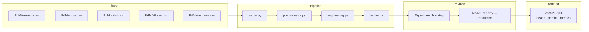

# Predictive Maintenance ML System


End-to-end ML Engineering challenge using the Microsoft Azure PdM dataset.  
Goal: predict whether a machine will fail in the next 24 hours using telemetry,
error logs, maintenance history and machine metadata.

---

## Reproducibility — Step by Step

Two paths depending on your setup. **Path A (Docker) is recommended** — it requires
zero Python configuration and runs everything in one command.

---

### Path A — Docker (recommended)

**Requirements**: [Docker Desktop](https://www.docker.com/products/docker-desktop/) installed and running.

**Step 1 — Clone the repository**

```bash
git clone https://github.com/harrysonguerrero-max/pdm-ml.git
cd pdm-ml
```

**Step 2 — Install `make`** (skip if already installed)

```bash
# Verify first — if it prints a version, skip this step:
make --version
```

**macOS:**
```bash
brew install make
# If brew is not installed: https://brew.sh — paste the one-liner from that page first
```

**Linux (Ubuntu / Debian):**
```bash
sudo apt-get update && sudo apt-get install -y make
```

**Windows — Scoop (recommended, no Administrator needed)**
```powershell
# 1. Set execution policy
Set-ExecutionPolicy RemoteSigned -Scope CurrentUser

# 2. Install Scoop
iwr -useb get.scoop.sh | iex

# 3. Add Scoop to PATH in current session
$env:Path += ";$HOME\scoop\shims"

# 4. Verify Scoop
scoop --version

# 5. Install make
scoop install make

# 6. Verify make
make --version
```

> After step 3, `$env:Path` fix is only needed for the **current session**.
> Open a **new PowerShell window** and `make` will work automatically from there.

**Windows — Chocolatey (alternative, requires Administrator)**
```powershell
# 1. Run in PowerShell as Administrator:
Set-ExecutionPolicy Bypass -Scope Process -Force; `
[System.Net.ServicePointManager]::SecurityProtocol = `
[System.Net.ServicePointManager]::SecurityProtocol -bor 3072; `
iex ((New-Object System.Net.WebClient).DownloadString('https://community.chocolatey.org/install.ps1'))

# 2. Close and reopen PowerShell as Administrator, then:
choco install make -y

# 3. Verify:
make --version
```

**Windows — Git Bash (zero install)**

If you have [Git for Windows](https://gitforwindows.org/) installed:
1. Open **Git Bash** (not PowerShell or CMD)
2. `make` is already available — no installation needed
3. Run all `make` commands from Git Bash

**Step 3 — Copy the environment file**

```bash
# Linux / macOS / Git Bash:
cp .env.example .env

# Windows PowerShell:
Copy-Item .env.example .env
```

**Step 4 — Download the dataset**

Go to https://www.kaggle.com/datasets/arnabbiswas1/microsoft-azure-predictive-maintenance,
click **Download**, unzip and place the 5 CSV files inside `data/raw/`.

Verify before continuing:

```bash
# Linux / macOS / Git Bash:
ls data/raw/

# Windows PowerShell:
dir data\raw\

# Must show:
# PdM_telemetry.csv  PdM_errors.csv  PdM_maint.csv  PdM_failures.csv  PdM_Machines.csv
```

**Step 5 — Full pipeline in one command**

```bash
make train-up
```

> Cleans previous state, starts MLflow, runs training pipeline (~5–10 min),
> registers model under **Production**, and starts the API.
> First run takes longer due to Docker image build.

**Step 6 — Watch training complete**

```bash
make logs
# Wait until you see: "Model promoted to Production"
# Press Ctrl+C to stop following logs — containers keep running
```

**Step 7 — Verify**

```bash
curl http://localhost:8000/health
# Expected: {"status":"healthy","model_loaded":true,"model_version":"1"}
```

| Service | URL |
|---|---|
| MLflow UI | http://localhost:5000 |
| REST API | http://localhost:8000 |
| API Docs (Swagger) | http://localhost:8000/docs |
| Prometheus Metrics | http://localhost:8000/metrics |

```bash
make down        # stop containers (data persists)
make demo-down   # stop containers + wipe all data (clean slate)
```

### Path B — Local Python (no Docker)

**Requirements**: Python 3.10, 3.11 or 3.12.

> `make` may not be available on Windows. Every step below shows
> both the `make` shortcut and the full command so you can use whichever works.

**Step 1 — Clone the repository**

```bash
git clone https://github.com/harrysonguerrero-max/pdm-ml.git
cd pdm-ml
```

**Step 2 — Copy the environment file**

```bash
# Linux / macOS / Git Bash:
cp .env.example .env

# Windows PowerShell:
Copy-Item .env.example .env
```

**Step 3 — Create and activate a virtual environment**

```bash
# Linux / macOS:
python -m venv .venv
source .venv/bin/activate

# Windows — Command Prompt:
python -m venv .venv
.venv\Scripts\activate.bat

# Windows — PowerShell:
python -m venv .venv
.venv\Scripts\Activate.ps1
```

> Your terminal prompt should now show `(.venv)`. This confirms the environment
> is active. All `pip` and `python` commands from here run inside it.

**Step 4 — Install dependencies**

```bash
pip install -e ".[dev]"
# Takes ~1–2 minutes on first run
```

**Step 5 — Download the dataset**

```bash
# Optional: install Kaggle CLI to download automatically
pip install kaggle
# Place your token at ~/.kaggle/kaggle.json
# Get it at: https://www.kaggle.com/settings → API → Create New Token
kaggle datasets download arnabbiswas1/microsoft-azure-predictive-maintenance
python -m zipfile -e microsoft-azure-predictive-maintenance.zip data/raw/
```

Or download manually from https://www.kaggle.com/datasets/arnabbiswas1/microsoft-azure-predictive-maintenance
and place the 5 CSV files in `data/raw/`.

**Step 6 — Start MLflow** (open a new terminal tab, keep it running)

```bash
# Activate the virtual environment in this new tab too:
source .venv/bin/activate        # Linux/macOS
.venv\Scripts\activate.bat       # Windows CMD
.venv\Scripts\Activate.ps1       # Windows PowerShell

# Then start MLflow:
make mlflow
# or without make:
mlflow server \
  --host 0.0.0.0 \
  --port 5000 \
  --backend-store-uri sqlite:///mlruns/mlflow.db \
  --default-artifact-root mlruns/artifacts
```

**Step 7 — Run the training pipeline** (back in your original terminal)

```bash
make train
# or without make:
python pipelines/train_pipeline.py

# Wait for: "Model promoted to Production — PR-AUC: 0.9994"
```

**Step 8 — Start the API**

```bash
make serve
# or without make:
uvicorn src.serving.app:app --host 0.0.0.0 --port 8000 --reload
```

**Step 9 — Verify**

```bash
curl http://localhost:8000/health
# Expected: {"status":"healthy","model_loaded":true,"model_version":"1"}
```

| Service | URL |
|---|---|
| MLflow UI | http://localhost:5000 |
| REST API | http://localhost:8000 |
| API Docs | http://localhost:8000/docs |
| Metrics | http://localhost:8000/metrics |

---

## Available Commands

### 🐳 Docker mode

| Command | Description |
|---|---|
| `make train-up` | **Full pipeline**: clean → MLflow → train → API (one command) |
| `make up` | Start MLflow + API + Prometheus (model must exist in Registry) |
| `make train` | Run training job in Docker (MLflow must be running) |
| `make down` | Stop all containers (data persists) |
| `make demo-down` | Stop containers + delete volumes (clean slate) |
| `make clean` | Full reset: containers + images + volumes + build cache |
| `make logs` | Follow live logs from all containers |
| `make logs-train` | Follow training job logs only |
| `make logs-api` | Follow API logs only |

### 💻 Local mode (no Docker)

| Command | Description |
|---|---|
| `make install` | Install package + dev dependencies |
| `make mlflow` | Start MLflow tracking server locally |
| `make train-local` | Start MLflow in background + run training pipeline |
| `make train` | Run training pipeline (MLflow must be running) |
| `make serve` | Start API locally with hot-reload |

### 🔬 Quality & Registry

| Command | Description |
|---|---|
| `make test` | Run full test suite |
| `make test-cov` | Run tests with coverage report |
| `make lint` | Check code style with ruff |
| `make format` | Auto-fix style issues |
| `make check` | `lint` + `test` in one command (run before committing) |
| `make rollback` | Demote current Production model → promote previous |
| `make registry-list` | List all registered model versions and stages |

## Environment Variables

Copy `.env.example` to `.env` before running anything.

```bash
cp .env.example .env
```

```dotenv
# MLflow
MLFLOW_TRACKING_URI=http://localhost:5000   # use http://mlflow:5000 inside Docker
MLFLOW_EXPERIMENT_NAME=pdm-predictive-maintenance
MLFLOW_MODEL_NAME=pdm-failure-predictor

# Data
RAW_DATA_PATH=data/raw
PROCESSED_DATA_PATH=data/processed

# Model
PREDICTION_WINDOW_HOURS=24
FAILURE_THRESHOLD=0.35
PROMOTION_MIN_PR_AUC=0.80     # auto-promote only if PR-AUC >= 0.80 (40× above baseline)
```

> **Docker users**: `MLFLOW_TRACKING_URI` is automatically overridden to
> `http://mlflow:5000` by `docker-compose.yml` — no manual change needed.

---

## Architecture



---

## Available Commands

| Command          | Description                                             |
|---|---|
| `make install`   | Install all dependencies                                |
| `make train`     | Run training pipeline (MLflow must be running)          |
| `make train-local` | Start MLflow in background + run pipeline             |
| `make serve`     | Start API locally with hot-reload                       |
| `make up`        | Build images, start MLflow + API with Docker Compose    |
| `make down`      | Stop all containers (data persists)                     |
| `make demo-down` | Stop containers + delete volumes (clean slate)          |
| `make logs`      | Follow live logs from all containers                    |
| `make logs-train`| Follow training job logs only                           |
| `make test`      | Run full test suite                                     |
| `make test-cov`  | Run tests with coverage report                          |
| `make lint`      | Check code style with ruff                              |
| `make check`     | `lint` + `test` in one command (run before committing)  |
| `make rollback`  | Demote current Production model → promote previous      |
| `make registry-list` | List all registered model versions and stages       |

---

## API Usage

### Health check

```bash
curl http://localhost:8000/health
```
```json
{
  "status": "healthy",
  "model_loaded": true,
  "model_version": "1",
  "model_name": "pdm-failure-predictor"
}
```

### Prediction

```bash
curl -X POST http://localhost:8000/predict \
  -H "Content-Type: application/json" \
  -d '{
    "machine_id": 1,
    "volt": 170.0, "rotate": 450.0, "pressure": 95.0, "vibration": 40.0,
    "volt_mean_3h": 170.5, "volt_std_3h": 1.2,
    "rotate_mean_3h": 450.1, "rotate_std_3h": 0.8,
    "pressure_mean_3h": 95.1, "pressure_std_3h": 0.5,
    "vibration_mean_3h": 40.1, "vibration_std_3h": 0.3,
    "volt_mean_24h": 170.2, "volt_std_24h": 2.1,
    "rotate_mean_24h": 449.9, "rotate_std_24h": 1.9,
    "pressure_mean_24h": 95.2, "pressure_std_24h": 1.1,
    "vibration_mean_24h": 40.0, "vibration_std_24h": 0.9,
    "volt_lag1": 170.1, "volt_lag2": 169.8, "volt_lag3": 170.3,
    "rotate_lag1": 450.2, "rotate_lag2": 449.8, "rotate_lag3": 450.0,
    "pressure_lag1": 94.8, "pressure_lag2": 95.2, "pressure_lag3": 95.0,
    "vibration_lag1": 40.2, "vibration_lag2": 39.8, "vibration_lag3": 40.1,
    "volt_delta": 0.5, "rotate_delta": -0.3,
    "pressure_delta": 0.2, "vibration_delta": -0.1,
    "error1_count": 0, "error2_count": 1, "error3_count": 0,
    "error4_count": 0, "error5_count": 0,
    "hours_since_comp1": 120, "hours_since_comp2": 240,
    "hours_since_comp3": 60, "hours_since_comp4": 180,
    "model_id": 2, "age": 7
  }'
```
```json
{
  "machine_id": 1,
  "failure_probability": 0.73,
  "prediction": 1,
  "prediction_label": "FAILURE EXPECTED",
  "prediction_window_hours": 24,
  "model_version": "1",
  "threshold_used": 0.35
}
```

### Prometheus Metrics

```bash
curl http://localhost:8000/metrics
# Returns Prometheus text format:
# http_requests_total{handler="/predict", method="POST", status_code="200"} 42.0
# http_request_duration_seconds_bucket{...}
```

### Model Rollback

```bash
make rollback        # demotes current Production → Archived, promotes last Archived
make registry-list   # inspect all registered versions and their stages
```

> Interactive docs with full schema and built-in request tester: http://localhost:8000/docs

---

## Project Structure

```
pdm-ml/
├── src/
│   ├── config.py              # Centralized config — Pydantic Settings
│   ├── data/
│   │   ├── loader.py          # Loads & validates 5 CSVs with Polars
│   │   └── preprocessor.py    # Joins, error counts, component ages, target
│   ├── features/
│   │   └── engineering.py     # Rolling stats, lags, deltas — 32 features
│   ├── models/
│   │   ├── trainer.py         # XGBoost + MLflow tracking + Registry promotion
│   │   └── evaluator.py       # PR-AUC, F2-Score, confusion matrix
│   └── serving/
│       ├── app.py             # FastAPI — /health · /predict · /metrics
│       └── schemas.py         # Pydantic I/O validation schemas
├── pipelines/
│   └── train_pipeline.py      # End-to-end pipeline entry point
├── scripts/
│   ├── rollback.py            # Demote Production → promote previous Archived
│   └── registry_list.py       # List all registered versions and stages
├── tests/
│   ├── conftest.py            # Shared in-memory fixtures (no CSV needed)
│   ├── test_loader.py
│   ├── test_features.py
│   ├── test_preprocessor.py
│   └── test_api.py
├── docker/
│   ├── Dockerfile
│   ├── docker-compose.yml
│   └── prometheus.yml         # Prometheus scraping config for /metrics
├── .github/workflows/ci.yml   # Lint + test on every push
├── .env.example
├── pyproject.toml
└── Makefile
```

---

## Key Design Decisions

| Decision              | Choice                      | Rationale |
|---|---|---|
| Problem framing       | Binary classification        | Operationally actionable; multiclass adds complexity without proportional value |
| Train/test split      | Temporal split, not random   | Simulates real production — model always predicts the future |
| Primary metric        | PR-AUC + F2-Score            | Accuracy is misleading at 1–3% positive rate; F2 penalises FN more than FP |
| Decision threshold    | 0.35 (not 0.5)               | FN (missed failure) costs 5–10× more than FP (unnecessary inspection) |
| Promotion threshold   | PR-AUC ≥ 0.80                | Only models 40× above baseline (~0.020) reach Production automatically |
| Imbalance handling    | `scale_pos_weight` in XGBoost | Avoids SMOTE leakage risk; no synthetic samples cross the train/test boundary |
| Experiment tracking   | MLflow + Registry            | Model version promoted to Production programmatically; serving loads from Registry |
| Feature engineering   | Polars, not Pandas           | 3–5× faster on this dataset size; cleaner API for rolling window operations |
| Observability         | Prometheus `/metrics`        | Exposes `http_requests_total`, latency histograms — scrapable by any Prometheus instance |
| Rollback              | `make rollback`              | Demotes current Production → Archived, promotes previous in < 30 seconds |
| Test strategy         | Pure in-memory fixtures      | `conftest.py` uses Polars DataFrames — no CSV files needed to run the test suite |

See [TECHNICAL_DESIGN.md](TECHNICAL_DESIGN.md) for full architecture documentation with diagrams,
alternatives considered, and trade-off analysis.

---

## Running Tests

```bash
# Full suite
make test

# With coverage
make test-cov

# Single file
pytest tests/test_api.py -v

# Single test
pytest tests/test_features.py::test_rolling_features_add_16_columns -v
```

Expected output:
```
tests/test_loader.py         ........ 8 passed
tests/test_features.py       .......... 10 passed
tests/test_preprocessor.py   .......... 10 passed
tests/test_api.py            ........... 11 passed
39 passed in Xs
```

---

## Reproducibility Guarantee

```bash
# Prove it from scratch — deletes all volumes and rebuilds
make demo-down
make up
make logs   # watch training complete and model register in MLflow
```

Every run produces a tracked MLflow experiment with:
- All hyperparameters logged
- PR-AUC, F2-Score, precision, recall on the temporal test set
- Confusion matrix artifact
- Model artifact registered in the Model Registry under **Production** stage
- Auto-promotion only if `PR-AUC >= 0.80` (configurable via `PROMOTION_MIN_PR_AUC`)
