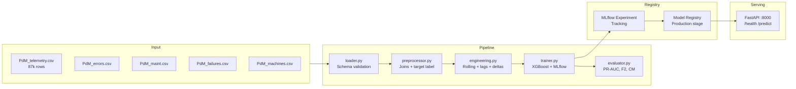

# Technical Design Document
## Predictive Maintenance ML System

---

## Architecture Overview



---

## Component Responsibilities

Each module has a single responsibility and is independently testable.

| File | Responsibility | Inputs | Outputs |
|---|---|---|---|
| `loader.py` | Read CSVs, validate schema, parse datetimes | Raw CSV paths | 5 Polars DataFrames |
| `preprocessor.py` | Join all tables, error counts, component ages, binary target | 5 DataFrames dict | Single enriched DataFrame |
| `engineering.py` | Add rolling stats, lag values, rate-of-change | Enriched DataFrame | Feature matrix (41 cols + target) |
| `trainer.py` | Temporal split, XGBoost train, MLflow tracking, Registry promotion | Feature matrix | Registered MLflow model |
| `evaluator.py` | Compute PR-AUC, F2, confusion matrix, log artifacts | Model + test set | Metrics dict + plots |
| `app.py` | Serve predictions via REST, load model from Registry | HTTP request | JSON prediction response |
| `schemas.py` | Pydantic input/output contracts | - | Request/Response models |
| `config.py` | Centralized settings via Pydantic BaseSettings | `.env` file | Typed config object |

**Design principle**: `preprocessor.py` handles business joins and label creation.
`engineering.py` handles pure signal extraction from telemetry. They have separate
test files and do not depend on each other — `engineering.py` calls `preprocessor.py`
only via the public `build_feature_table()` orchestrator.

---

## Data Flow

```
PdM_telemetry.csv  (876,100 rows × 6 cols)
PdM_errors.csv     (3,919 rows  × 3 cols)
PdM_maint.csv      (3,286 rows  × 3 cols)
PdM_failures.csv   (761 rows    × 3 cols)
PdM_machines.csv   (100 rows    × 3 cols)
        │
        ▼ loader.py
        │  → Schema validation (required columns per table)
        │  → Datetime parsing (string → pl.Datetime)
        │  → FileNotFoundError on missing CSVs
        │
        ▼ preprocessor.py → build_preprocessed_table()
        │  → Sort by (machineID, datetime)
        │  → Join machine age + model_id            (+2 cols)
        │  → Error count per type, 24h window       (+5 cols: error1..5_count)
        │  → Hours since last component replacement (+4 cols: hours_since_comp1..4)
        │  → Binary target label (24h forward window) (+1 col: target)
        │
        ▼ engineering.py → build_all_features()
        │  → Rolling mean + std (3h, 24h) per sensor (+16 cols)
        │  → Lag values (1h, 2h, 3h) per sensor     (+12 cols)
        │  → Rate of change (delta t-1) per sensor   (+4 cols)
        │
        ▼  Final feature matrix: ~876,100 rows × ~43 cols
        │  (4 raw sensors + 12 error/maint/meta + 32 engineered + 1 target)
        │
        ▼ trainer.py → temporal_split()
        │  → Train: Jan 2015 – Sep 2015  (~75%)
        │  → Test:  Oct 2015 – Jan 2016  (~25%)
        │  (Never random — preserves time ordering)
        │
        ▼ trainer.py → train_and_track()
           → XGBoost with scale_pos_weight
           → MLflow: log params, metrics, artifacts
           → Model Registry: promote to Production if PR-AUC > threshold
```

---

## Feature Engineering

| Group | Columns | Count | Rationale |
|---|---|---|---|
| Rolling mean (3h, 24h) | volt, rotate, pressure, vibration | 8 | Short and long degradation trends |
| Rolling std (3h, 24h) | volt, rotate, pressure, vibration | 8 | Volatility signals instability |
| Lag values (1h, 2h, 3h) | volt, rotate, pressure, vibration | 12 | Recent history context per machine |
| Rate of change (delta) | volt, rotate, pressure, vibration | 4 | Abrupt changes precede failures |
| Error counts (24h window) | error1..5_count | 5 | Error frequency is a strong failure predictor |
| Hours since maintenance | comp1..4 | 4 | Recently replaced components rarely fail |
| Machine metadata | model_id, age | 2 | Static context per machine |

**Total: 43 features + 1 target column**

All features are **strictly backward-looking**: they only use data available
at prediction time, with no leakage from the future.

---

## Anti-Leakage Strategy

| Rule | Implementation |
|---|---|
| All features backward-looking | Rolling/lag windows use `shift()` and `rolling()` with `over("machineID")` |
| Target is forward-looking | Label = failure in next N hours; does not include the failure row itself |
| Temporal split only | Hard cutoff date; `sklearn.train_test_split` with `shuffle=False` never used |
| Error/maintenance counts | Filtered to `event_dt <= current_dt` before aggregation |
| No SMOTE before split | `scale_pos_weight` adjusts the loss function; no synthetic rows cross the boundary |

---

## Technical Decisions

| Decision | Chosen | Alternatives considered | Reason |
|---|---|---|---|
| Problem framing | Binary (fail / no fail in 24h) | Multiclass per component | Simpler, defensible, operationally useful; multiclass adds complexity without proportional value |
| Model | XGBoost | LightGBM, Neural Net, Random Forest | Best performance on structured tabular data at this scale; fast; interpretable via SHAP |
| Imbalance handling | `scale_pos_weight` | SMOTE, class_weight, oversampling | SMOTE on temporal data risks carrying future information into synthetic samples |
| Primary metric | PR-AUC + F2-Score | Accuracy, ROC-AUC | Accuracy is misleading at 1-3% positive rate; F2 penalises FN 2x more than FP |
| Decision threshold | 0.35 | 0.5 (default) | FN (missed failure) costs ~5-10x more than FP (unnecessary inspection) |
| Data processing | Polars | Pandas | 3-5x faster on this dataset; more explicit API for window operations; no implicit index |
| Experiment tracking | MLflow (self-hosted) | Weights & Biases, Neptune | Self-hosted; explicitly mentioned in job description; Registry enables programmatic promotion |
| Serving | FastAPI | Flask, Django | Native async; Pydantic validation; automatic OpenAPI docs at /docs |
| Containerisation | Single Dockerfile | Separate train/serve images | Acceptable for demo scope; production would split to minimise serve image size |
| Config management | Pydantic BaseSettings + .env | Hardcoded, argparse | Type-safe; works locally and in Docker without code changes |

---

## Security and Secrets Handling

- All credentials and configuration live in `.env`, which is **gitignored**.
- `.env.example` is committed with placeholder values — no real secrets in the repo.
- Inside Docker, secrets are injected via `env_file` in `docker-compose.yml`.
- No API keys, passwords or tokens are hardcoded anywhere in the source code.
- MLflow tracking URI is an environment variable — switching from local SQLite to a
  remote server requires only a `.env` change, no code modifications.
- In a production setup, secrets would be managed via a vault (e.g., HashiCorp Vault,
  AWS Secrets Manager, or Azure Key Vault) injected at runtime.

---

## CI/CD Pipeline

```
git push → GitHub Actions (ci.yml)
    │
    ├── ruff check src/ tests/ pipelines/   ← lint
    └── pytest tests/ -v --tb=short         ← test suite (no CSV needed)
```

**Design decision — no CSV files in CI:**
`conftest.py` provides pure in-memory Polars fixtures. The test suite runs in
< 30 seconds with zero external dependencies. This makes CI fast and free of
Kaggle authentication requirements.

**What CI does NOT do (scope decision):**
- Does not build Docker image on every push (build time cost vs. demo value)
- Does not run the full training pipeline in CI (requires real data)
- A production CI/CD would add: image build, integration tests with real data sample,
  automated model promotion, and staging deployment.

---

## Monitoring Roadmap

| Signal | Tool | Trigger |
|---|---|---|
| Input data drift | Evidently AI | Distribution shift in sensor means/stds |
| Model performance degradation | MLflow + scheduled eval | PR-AUC drops below promotion threshold |
| API latency + error rate | Prometheus + Grafana | p99 latency > 500ms or error rate > 1% |
| Retraining | Airflow DAG | Drift detected or scheduled weekly |
| Rollback | MLflow Registry | Stage transition: Production → Archived; previous version promoted |

---

## Deployment Architecture (Demo vs. Production)

| Aspect | Demo (this repo) | Production |
|---|---|---|
| Orchestration | `docker-compose up` | Kubernetes (GKE / AKS) |
| MLflow backend | SQLite in Docker volume | PostgreSQL + GCS/Azure Blob |
| Serving | Single FastAPI container | Replicated pods behind load balancer |
| Retraining | Manual `make train` | Airflow DAG on schedule or drift trigger |
| Secrets | `.env` file | HashiCorp Vault / Azure Key Vault |
| Monitoring | None | Prometheus + Grafana + Evidently |
| Image registry | Local Docker | GCP Artifact Registry / Azure ACR |
