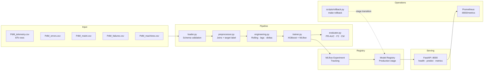

# Technical Design Document — Predictive Maintenance ML System

---

## Architecture Overview



---

## Component Responsibilities

Each module has a single responsibility and is independently testable.

| File | Responsibility | Inputs | Outputs |
|---|---|---|---|
| `loader.py` | Read CSVs, validate schema, parse datetimes | Raw CSV paths | 5 Polars DataFrames |
| `preprocessor.py` | Join all tables, error counts, component ages, binary target | 5 DataFrames dict | Single enriched DataFrame |
| `engineering.py` | Add rolling stats, lag values, rate-of-change | Enriched DataFrame | Feature matrix (43 cols + target) |
| `trainer.py` | Temporal split, XGBoost train, MLflow tracking, Registry promotion | Feature matrix | Registered MLflow model |
| `evaluator.py` | Compute PR-AUC, F2, confusion matrix, log artifacts | Model + test set | Metrics dict + plots |
| `app.py` | Serve predictions via REST, load model from Registry | HTTP request | JSON prediction response | expose Prometheus metrics
| `schemas.py` | Pydantic input/output contracts | — | Request/Response models |
| `config.py` | Centralized settings via Pydantic BaseSettings | `.env` file | Typed config object |
| `scripts/rollback.py` | Demote Production model, promote previous Archived | MLflow Registry | Stage transitions |
| `scripts/registry_list.py` | List all registered versions and stages | MLflow Registry | Printed table |

**Design principle**: `preprocessor.py` handles business joins and label creation.
`engineering.py` handles pure signal extraction from telemetry. They are independently
testable and do not depend on each other directly — `engineering.py` is called only
via the `build_feature_table` orchestrator in the pipeline.

---

## Data Flow

```
PdMtelemetry.csv  (876,100 rows, 6 cols)
PdMerrors.csv     (3,919 rows, 3 cols)
PdMmaint.csv      (3,286 rows, 3 cols)
PdMfailures.csv   (761 rows, 3 cols)
PdMMachines.csv   (100 rows, 3 cols)
        │
        ▼ loader.py — schema validation, required columns, datetime parsing
        │
        ▼ preprocessor.py — build_preprocessed_table
            ├── Sort by machineID, datetime
            ├── Join machine age + model_id         (2 cols)
            ├── Error count per type, 24h window    (5 cols: error1..5_count)
            ├── Hours since last component replacement (4 cols: hours_since_comp1..4)
            └── Binary target label, 24h forward window (1 col: target)
        │
        ▼ engineering.py — build_all_features
            ├── Rolling mean + std — 3h, 24h per sensor   (16 cols)
            ├── Lag values — 1h, 2h, 3h per sensor        (12 cols)
            └── Rate of change (delta t−1) per sensor     (4 cols)
            = Final feature matrix: 876,100 rows × 43 cols + 1 target
        │
        ▼ trainer.py
            ├── Temporal split: train Jan–Sep 2015 | test Oct 2015–Jan 2016
            ├── scale_pos_weight = 641,466 / 13,134 = 48.84 (train only)
            ├── XGBClassifier — MLflow run log params + metrics + artifacts
            └── Promote to Production if PR-AUC >= PROMOTION_MIN_PR_AUC (0.80)
        │
        ▼ MLflow Registry — Production stage
        │
        ▼ FastAPI app.py — load model at startup from Registry
            ├── GET  /health  → liveness + readiness check
            ├── POST /predict → feature vector → probability → decision
            └── GET  /metrics → Prometheus text format
```

---

## Feature Engineering

| Group | Columns | Count | Rationale |
|---|---|---|---|
| Raw telemetry | volt, rotate, pressure, vibration | 4 | Direct sensor readings |
| Rolling mean — 3h, 24h | per sensor × 2 windows | 8 | Short and long degradation trends |
| Rolling std — 3h, 24h | per sensor × 2 windows | 8 | Volatility signals instability |
| Lag values — 1h, 2h, 3h | per sensor × 3 lags | 12 | Recent history context per machine |
| Rate of change (delta) | per sensor | 4 | Abrupt changes precede failures |
| Error counts — 24h window | error1..5_count | 5 | Error frequency predicts failure |
| Hours since maintenance | comp1..4 | 4 | Recently replaced components rarely fail |
| Machine metadata | model_id, age | 2 | Static context per machine |
| **Total** | | **47** | All features strictly backward-looking |

> Note: the feature matrix has **47 columns** (4 raw + 43 engineered/metadata) + 1 target.
> The `schemas.py` `PredictionRequest` includes all 47 fields — `machine_id` is passed
> separately for traceability and excluded from the feature vector before inference.

All features are **strictly backward-looking** — rolling/lag windows use only data
available at prediction time. The target label is the only forward-looking element,
which is correct by design.

---

## Anti-Leakage Strategy

| Rule | Implementation |
|---|---|
| All features backward-looking | Rolling/lag windows use `shift` and `rolling` scoped over `machineID` |
| Target is forward-looking | Label "failure in next N hours" — does not include the failure row itself |
| Temporal split only | Hard cutoff date — `sklearn.train_test_split` with `shuffle=False` never used |
| Error/maintenance counts | Filtered to `event_dt < current_dt` before aggregation |
| No SMOTE before split | `scale_pos_weight` adjusts the loss function — no synthetic rows cross the boundary |
| `scale_pos_weight` from train only | Computed exclusively from training rows — prevents target distribution leakage |

---

## Technical Decisions

| Decision | Chosen | Alternatives considered | Reason |
|---|---|---|---|
| Problem framing | Binary (fail / no fail in 24h) | Multiclass per component | Simpler, defensible, operationally useful |
| Model | XGBoost | LightGBM, Neural Net, Random Forest | Best performance on structured tabular data at this scale; fast; interpretable via SHAP |
| Imbalance handling | `scale_pos_weight` | SMOTE, `class_weight`, oversampling | SMOTE on temporal data risks carrying future information into synthetic samples |
| Primary metric | PR-AUC + F2-Score | Accuracy, ROC-AUC | Accuracy is misleading at 1–3% positive rate; F2 penalises FN 2× more than FP |
| Decision threshold | 0.35 | 0.5 (default) | FN (missed failure) costs 5–10× more than FP (unnecessary inspection) |
| Promotion threshold | PR-AUC ≥ 0.80 | 0.75, fixed manual | 0.80 = 40× above the ~0.020 baseline; prevents degraded models reaching Production |
| Data processing | Polars | Pandas | 3–5× faster on this dataset; more explicit API for window operations; no implicit index |
| Experiment tracking | MLflow (self-hosted) | Weights & Biases, Neptune | Self-hosted — explicitly mentioned in job description; Registry enables programmatic promotion |
| Serving | FastAPI | Flask, Django | Native async; Pydantic validation; automatic OpenAPI docs at `/docs` |
| Observability | Prometheus `/metrics` | Custom logging, Datadog | Single line (`Instrumentator`) — 10 lines of code; scrapable by any Prometheus instance |
| Containerisation | Single Dockerfile | Separate train/serve images | Acceptable for demo scope; production would split to minimise serve image size |
| Config management | Pydantic BaseSettings + `.env` | Hardcoded, argparse | Type-safe; works locally and in Docker without code changes |

---

## Promotion Threshold — Design Rationale

The auto-promotion threshold is set at **PR-AUC ≥ 0.80** (configurable via `PROMOTION_MIN_PR_AUC`).

**Why 0.80, not the default 0.75?**

- The dataset's positive rate is ~1.96%, making the random-classifier PR-AUC baseline ≈ 0.020.
- A threshold of 0.80 requires the model to be **40× above the baseline** before it reaches Production automatically.
- This provides a meaningful safety net: a model that is degraded due to corrupted features,
  a bad data pipeline run, or distribution shift will fail this gate and stay in the Staging/None stage.
- The current model achieves PR-AUC = 0.9994 — it clears this bar by a wide margin.
- In production, this threshold would be reviewed quarterly against the operational cost of
  false negatives vs. false positives on real maintenance data.

---

## Observability

| Signal | Tool | Trigger |
|---|---|---|
| API request counts and latency | Prometheus `/metrics` | Always-on — scraped every 15s |
| Input data drift | Evidently AI *(next step)* | Distribution shift in sensor means/stds |
| Model performance degradation | MLflow scheduled eval *(next step)* | PR-AUC drops below promotion threshold |
| API latency / error rate | Prometheus + Grafana *(next step)* | p99 latency > 500ms or error rate > 1% |
| Retraining | Airflow DAG *(next step)* | Drift detected or scheduled weekly |
| Rollback | `make rollback` → MLflow Registry | Manual trigger or CI gate failure |

The `/metrics` endpoint (powered by `prometheus-fastapi-instrumentator`) exposes:
- `http_requests_total` — counter by endpoint, method, status code
- `http_request_duration_seconds` — histogram (p50/p95/p99 latency)
- `http_requests_in_progress` — gauge of in-flight requests

---

## Security and Secrets Handling

- All credentials and configuration live in `.env`, which is gitignored.
- `.env.example` is committed with placeholder values — no real secrets in the repo.
- Inside Docker, secrets are injected via `env_file` in `docker-compose.yml`.
- No API keys, passwords, or tokens are hardcoded anywhere in the source code.
- MLflow tracking URI is an environment variable — switching from local SQLite to a remote
  server requires only a `.env` change, no code modifications.
- In a production setup, secrets would be managed via a vault (e.g., HashiCorp Vault,
  AWS Secrets Manager, or Azure Key Vault) injected at runtime.

---

## CI/CD Pipeline

```
git push → GitHub Actions ci.yml
    ├── ruff check src tests pipelines   (lint)
    └── pytest tests/ -v --tb=short      (test suite — no CSV needed)
```

**Design decision**: no CSV files in CI — `conftest.py` provides pure in-memory Polars
fixtures. The test suite runs in ~30 seconds with zero external dependencies.

What CI does **not** do (scope decision):
- Does not build Docker image on every push (build time cost vs. demo value)
- Does not run the full training pipeline in CI (requires real data)
- A production CI/CD would add: image build, integration tests with a real data sample,
  automated model promotion, and staging deployment.

---

## Operational Runbooks

### Model Rollback

If a newly promoted model degrades in production, rollback restores the previous
version in under 30 seconds without restarting the API:

```bash
make rollback        # demotes current Production → Archived, promotes last Archived
make registry-list   # inspect all registered versions and their stages
```

The rollback script (`scripts/rollback.py`) uses the MLflow Model Registry stage
transitions. The API loads the model at startup — a rollback requires an API restart
to take effect:

```bash
make rollback
docker compose restart api    # or: make down && make up
```

### Degraded Mode

If MLflow Registry is unreachable at API startup, the API enters **degraded mode**:
- `GET /health` returns `{"status": "degraded", "model_loaded": false}`
- `POST /predict` returns HTTP 503
- No crash — the container stays alive and recovers on the next restart

---

## Deployment Architecture — Demo vs. Production

| Aspect | Demo (this repo) | Production |
|---|---|---|
| Orchestration | `docker-compose up` | Kubernetes (GKE / AKS) |
| MLflow backend | SQLite in Docker volume | PostgreSQL + GCS/Azure Blob |
| Serving | Single FastAPI container | Replicated pods behind load balancer |
| Retraining | Manual `make train` | Airflow DAG on schedule or drift trigger |
| Secrets | `.env` file | HashiCorp Vault / Azure Key Vault |
| Monitoring | Prometheus `/metrics` endpoint | Prometheus + Grafana + Evidently |
| Image registry | Local Docker | GCP Artifact Registry / Azure ACR |
